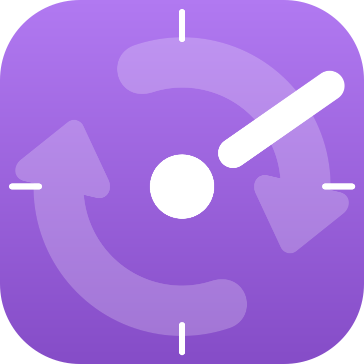

  

# Furtherance Sync

This is the official sync server for [Furtherance](github.com/unobserved-io/Furtherance). If you would like the easiest way possible to sync your Furtherance history, you can sign up for a hosted account [here](https://furtherance.app/sync).
If you would prefer to self-host Furtherance Sync, continue reading.

## Features

* End-to-end encrypted
* First-class integration with Furtherance
* Cross-platform (currently Windows, macOS, and Linux)
* Self-hostable

## Install with Docker Compose

The easiest way to install Furtherance Sync is with Docker. Download the [docker-compose.yml](https://github.com/unobserved-io/furtherance-sync/blob/main/docker-compose.yml) and change the envrionment variables in it for your desired PostgreSQL user and password.

In the folder where you downloaded the `docker-compose.yml`, run `docker-compose up -d` to start the server.

You can then navigate to `localhost:8662` to set up an account.

Once you've created an account, log in and generate an encryption key. Make sure you securely store your key. This key will be what you use to log into the sync server from the Furtherance client.

## Install on NixOS (Docker)

You can copy the `docker.nix` file to install the Docker container on your NixOS machine. Remember to change the environment variables as mentioned above.

Docker must already be enabled on your NixOS machine (by adding `virtualisation.docker.enable = true;` to your Nix config).

## Avoid the Headache

If you would like to sync your Furtherance history without the headache of hosting it yourself, you can purchase a hosted account for $20/year with a 7-day free trial.

This is also a great way to support the free and open-source [Furtherance](github.com/unobserved-io/Furtherance) project!

### Donate
If you prefer to self-host Furtherance Sync but would still like to contribute to the project, you can do so via these links:
* [PayPal](https://www.paypal.com/donate/?hosted_button_id=TLYY8YZ424VRL)
* [GitHub](https://github.com/sponsors/rickykresslein)
* [Patreon](https://www.patreon.com/unobserved)
* [Ko-fi](https://ko-fi.com/unobserved)

Thank you so much for your contribution! I truly appreciate it.

### License
This project is licensed under the Elastic License 2.0. See the [LICENSE](LICENSE) file for details.

### Author
This project is created and maintained by [Ricky Kresslein](https://kressle.in) under [Unobserved](https://unobserved.io). More information at [Furtherance.app](https://furtherance.app/sync).
